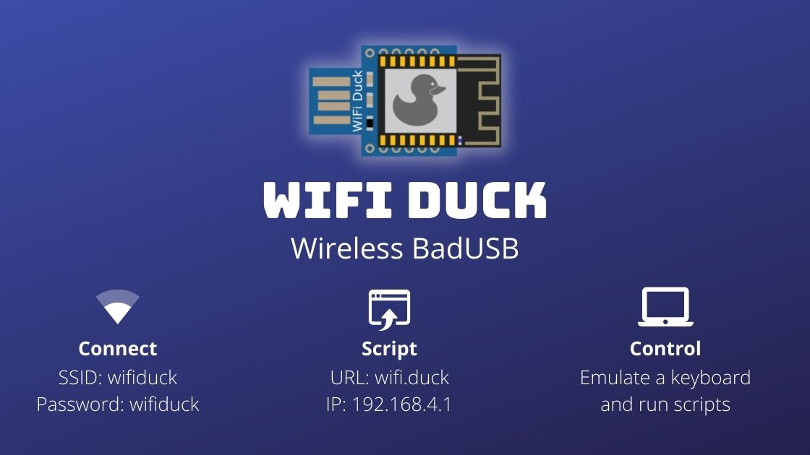

# WiFi Duck

### 👉 Visit [wifiduck.com](https://wifiduck.com) for an improved documentation.

Want to learn more about BadUSBs? Check out our online course: [learnbadusb.com](https://learnbadusb.com) 

---

* [About](#about)
* [Usage](#usage)
* [Support us](#support-us)
* [Buy Hardware](#buy-hardware)
  + [Malduino W](#malduino-w)
  + [DSTIKE WiFi Duck](#dstike-wifi-duck)
* [DIY Hardware](#diy-hardware)
  + [Atmega32u4 Development Boards](#atmega32u4-development-boards)
  + [ESP8266 Development Boards](#esp8266-development-boards)
  + [Connections](#connections)
  + [PCB](#pcb)
* [Flash Software](#flash-software)
  + [Flash Atmega32u4](#flash-atmega32u4)
  + [Flash ESP8266](#flash-esp8266)
  + [Unbrick Atmega32u4](#unbrick-atmega32u4)
* [Scripting](#scripting)
  + [Basics](#basics)
  + [Functions](#functions)
  + [Standard Keys](#standard-keys)
  + [Modifier Keys](#modifier-keys)
  + [Other Keys](#other-keys)
  + [Numpad Keys](#numpad-keys)
  + [Examples](#examples)
* [CLI Commands](#cli-commands)
  + [General](#general)
  + [SPIFFS File Management](#spiffs-file-management)
* [How to Debug](#how-to-debug)
* [Development](#development)
  + [Edit Web Files](#edit-web-files)
  + [Translate Keyboard Layout](#translate-keyboard-layout)
* [Disclaimer](#disclaimer)
* [License](#license)
* [Credits](#credits)

